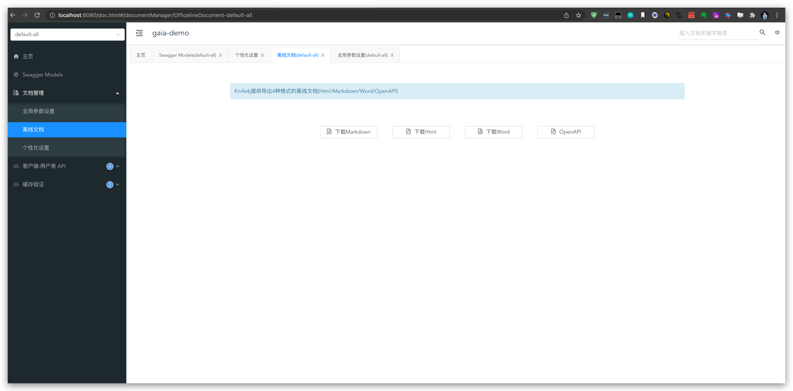

# badger-SWAGGER

---
## 简介

该`Swagger`组件主要是基于[knife4j](https://doc.xiaominfo.com/) 进行扩展而来

扩展的功能点如下:

更友好支持接口文档的分组功能,便于开发同学定向导出文档

> 使用时,只在需要导出文档的方法上加`@SwaggerMethodExport`即可,或者在某个需要导出文档的类上加`@SwaggerTypeExport`即可.
> 
> `Swagger`文档会分成三组:`default-all/method-export/type-export`
> 
* `default-all`组默认导出全部文档;
* `method-export`组导出添加了`@SwaggerMethodExport`注解的接口文档;
* `type-export`导出添加了`@SwaggerTypeExport`注解的接口文档;



## 用法

maven pom.xml 中添加依赖

```xml
<dependency>
    <groupId>com.honey</groupId>
    <artifactId>badger-swagger</artifactId>
    <version>${badger.version}</version>
</dependency>
```

application.properties 中你的项目进行描述.注意:`honey.badger.swagger.basePackage`是必填项,如果不填,则`swagger`会扫描不到所在的`controller`目录

```properties
honey.badger.swagger.enabled=true
honey.badger.swagger.description=demo swagger description
honey.badger.swagger.contact.name=haojinlong
honey.badger.swagger.contact.url=localhost:8080
honey.badger.swagger.contact.email=haokinglong@outlook.com
honey.badger.swagger.basePackage=com.honey.badger.demo
knife4j.enable=true
knife4j.production=false
knife4j.basic.enable=true
#swagger文档查看登陆以用户名+密码,团队内部自定义即可
knife4j.basic.username=hao
knife4j.basic.password=123456
```

针对你的 dto:  

* 在 class 上使用 @ApiModel
* 在 field 上使用 @ApiModelProperty

```java
@ApiModel("env 信息")
@Data
@NoArgsConstructor
public class EnvDTO {

    @ApiModelProperty(value = "自增id", example = "1")
    private Integer id;
    @ApiModelProperty(value = "环境名称", example = "dev")
    private String name;
    @ApiModelProperty(value = "环境描述", example = "研发环境")
    private String description;
    @ApiModelProperty(value = "创建者", example = "haojinlong")
    private String createBy;
    @ApiModelProperty(value = "修改者", example = "haojinlong")
    private String updateBy;
    @ApiModelProperty(value = "创建时间", example = "2021-01-01T01:00:00")
    private Date createTime;
    @ApiModelProperty(value = "修改时间", example = "2021-01-01T01:00:00")
    private Date updateTime;
}
```

针对你的 controller

在 class 上使用 @Api
在 method 上使用 @ApiOperation
在 param 上使用 @ApiParam
```java
@Api(value = "env 相关API", tags = {"env"})
@RestController
@RequestMapping("api/envs")
public class EnvController {

    @Resource
    private EnvService envService;

    @ApiOperation(value = "分页获取环境列表", notes = "curl -X GET \"http://127.0.0.1:8080/api/envs?pageNum=0&pageSize=10\" -H \"accept: application/json;charset=UTF-8\"")
    @GetMapping(value = "", produces = MediaType.APPLICATION_JSON_UTF8_VALUE)
    public BaseResponse<PageInfo<EnvDTO>> pagianteEnvs(
            @ApiParam(value = "当前页码", required = false)
            @Valid @Min(0)
            @RequestParam(value = "pageNum", required = false, defaultValue = "0") Integer pageNum,

            @ApiParam(value = "分页大小", required = false)
            @Valid @Min(1)
            @RequestParam(value = "pageSize", required = false, defaultValue = "10") Integer pageSize,

            @ApiParam(value = "环境名称", required = false)
            @RequestParam(value = "name", required = false) String name
    ) {
        return new BaseResponse(envService.paginateEnvs(pageNum, pageSize, name));
    }
}
```
注意上面的 @ApiOperation 的 notes 里写的 `curl -X` 什么的只是描述, 随便写什么都可以

当需要单独导出某个方法时,在该方法上使用`@SwaggerMethodExport`注解
```java
@Api(value = "env 相关API", tags = {"env"})
@RestController
@RequestMapping("api/envs")
public class EnvController {

    @Resource
    private EnvService envService;

    @SwaggerMethodExport
    @ApiOperation(value = "分页获取环境列表", notes = "curl -X GET \"http://127.0.0.1:8080/api/envs?pageNum=0&pageSize=10\" -H \"accept: application/json;charset=UTF-8\"")
    @GetMapping(value = "", produces = MediaType.APPLICATION_JSON_UTF8_VALUE)
    public BaseResponse<PageInfo<EnvDTO>> pagianteEnvs(
            @ApiParam(value = "当前页码", required = false)
            @Valid @Min(0)
            @RequestParam(value = "pageNum", required = false, defaultValue = "0") Integer pageNum,

            @ApiParam(value = "分页大小", required = false)
            @Valid @Min(1)
            @RequestParam(value = "pageSize", required = false, defaultValue = "10") Integer pageSize,

            @ApiParam(value = "环境名称", required = false)
            @RequestParam(value = "name", required = false) String name
    ) {
        return new BaseResponse(envService.paginateEnvs(pageNum, pageSize, name));
    }
}
```

当需要单独导出某个类下的所有方法时,在该类上使用`@SwaggerTypeExport`注解
```java
@Api(value = "env 相关API", tags = {"env"})
@SwaggerTypeExport
@RestController
@RequestMapping("api/envs")
public class EnvController {

    @Resource
    private EnvService envService;
    
    @ApiOperation(value = "分页获取环境列表", notes = "curl -X GET \"http://127.0.0.1:8080/api/envs?pageNum=0&pageSize=10\" -H \"accept: application/json;charset=UTF-8\"")
    @GetMapping(value = "", produces = MediaType.APPLICATION_JSON_UTF8_VALUE)
    public BaseResponse<PageInfo<EnvDTO>> pagianteEnvs(
            @ApiParam(value = "当前页码", required = false)
            @Valid @Min(0)
            @RequestParam(value = "pageNum", required = false, defaultValue = "0") Integer pageNum,

            @ApiParam(value = "分页大小", required = false)
            @Valid @Min(1)
            @RequestParam(value = "pageSize", required = false, defaultValue = "10") Integer pageSize,

            @ApiParam(value = "环境名称", required = false)
            @RequestParam(value = "name", required = false) String name
    ) {
        return new BaseResponse(envService.paginateEnvs(pageNum, pageSize, name));
    }
}
```

