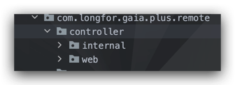

# badger-WEB-CORE

---

## 简介

该包主要是针对`web`服务请求做一些封装

* 增加请求拦截,基于`MDC`,从请求头中获取相应的参数供日志统一打印
* 增加了通过`AOP`将响应体统一封装返回
* 新增了针对`ahas`埋点限流异常的捕获,以特定业务异常码`GP5429`返回,`http status`为`429`

```json
{
  "code": "GP5429",
  "message": "too many request"
}  
```

* 联合`badger-feign`包,针对微服务集群内部调用(路径中包含`/_private/`的并且同时添加注解`@Raw`都默认为内部调用),`http status`异常码改为`206`返回,同时响应体默认不做任何处理,原生返回.不用担心的是,当请求真正返回调用方时,会以正常的业务异常返回,如此操作只是为了降低微服务内部调用成本

## 使用:

### 1. 添加包依赖

```xml

<dependency>
    <groupId>com.honey</groupId>
    <artifactId>badger-web-core</artifactId>
    <version>${badger.version}</version>
</dependency>
```

### 2. 目录最佳实践建议如下图所示



* `web`包内为对外提供的`API`
* `internal`包为微服务内部调用提供的`API`

#### 2.1 以下是内部调用示例:

**注意点:**
> a. `@RequestMapping`中的路径需要添加`/_private`,以标识为内部调用\
> b. 方法上需要添加`@Raw`注解,表示该方法不需要被统一封装,需要原生返回,比如下图返回的对象就是`User`

```java
/**
 * 描述：类 {@code User} 用户表API
 *
 * @author haojinlong
 * @date 2021-09-23
 */
@Api(tags = "内部:用户表 API")
@Slf4j
@RestController
@RequestMapping("/users/_private")
public class InternalUserController {

    @Autowired
    private UserService userService;

    /**
     * 根据id获取用户信息
     *
     * @param userId 用户id
     * @return {@link User}
     * @author haojinlong
     * @date 2021-09-23
     */
    @Raw
    @ApiOperation("根据id获取用户信息")
    @GetMapping("/{userId}")
    public User getUser(@PathVariable String userId) {
        return userService.getUserById(userId);
    }
}
```

#### 2.2 以下是外部调用示例:

> a. 无需添加任何 参数/注解\
> b. 返回参数可以不用刻意的手动封装为`BaseResponse`再返回

```java
/**
 * 描述：类 {@code User} 用户表API
 *
 * @author haojinlong
 * @date 2021-09-23
 */
@Api(tags = "客户端:用户表 API")
@Slf4j
@RestController
@RequestMapping("/users")
public class UserResource {

    @Autowired
    private UserService userService;

    /**
     * 根据id获取用户信息
     *
     * @param userId 用户id
     * @return {@link User}
     * @author haojinlong
     * @date 2021-09-23
     */
    @ApiOperation("根据id获取用户信息")
    @GetMapping("/{userId}")
    public User getUser(@PathVariable String userId) {
        return userService.getUserById(userId);
    }
}
```


